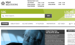

# Wellejus theme for Ding2

A sub-theme based on DDBasic theme for ding2.

## Setup

Enable ddbasic theme. Then enable Wellejus theme and set it as the active theme

## SASS

Wellejus uses SASS to generate its CSS files. File naming conventions are based on the use of SASS in DDBasic theme.